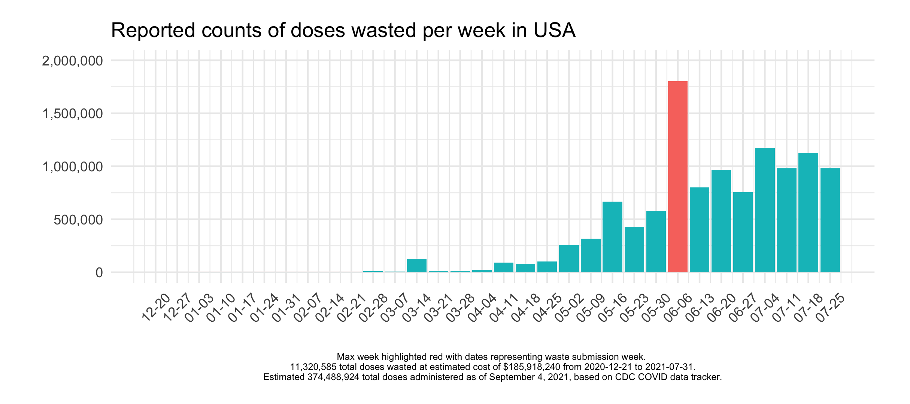
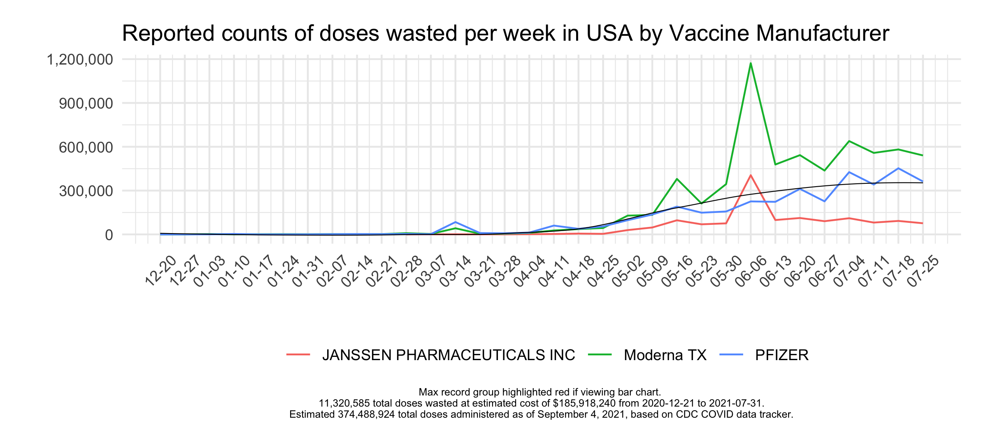
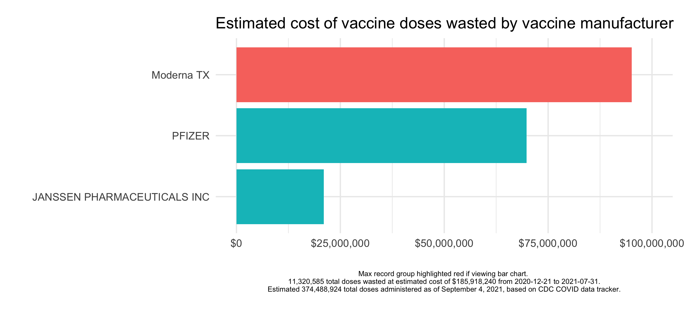

# covid19-vaccine-dose-waste-in-usa

Plots representing covid-19 vaccine dose waste in the USA embedded below. Note that there may be reporting bias (underreporting) in the data extract used. Dates represent wastage submission date in graphs below (not necessarily actual date of dose wasted which is unknown from data extract). 

Credit to [a data scientist](https://anonymousdata.medium.com/) for filing a FOIA request with CDC for the dataset on vaccine waste. Links to data and original medium post below. Additionally, I would skim the recommended readings below, if interested in exploring further, since they provide additional context. The [post](https://www.someweekendreading.blog/vaccine-waste/
) from someweekendreading's blog is particularly insightful. Relative to other vaccine campaigns (see `someweekendreading's blog post` and the `Revising_Wastage_Concept_Note.pdf`), the estimated waste rates so far indicate that we're doing pretty well. Estimated costs info added via cost information from  news article [here](https://www.fiercepharma.com/pharma/pfizer-eyes-higher-covid-19-vaccine-prices-after-pandemic-exec-analyst).

R scripts to used process the data in `R/`. Run `load.R` first then run `analysis.R`. Ensure packages are installed prior. If you're running the latest version of RStudio then you should get a notification to install missing packages. Not including original data in the repo, but the scripts will download/import the data and export a few graphs.

## data source:
* https://anonymousdata.medium.com/the-cdc-reported-11-3-million-wasted-covid-19-vaccine-doses-in-8-months-5bdff71a850a
* https://adatascienti.st/cdc/wastage.xlsx (note that there are two sheets in the spreadsheet)
* https://adatascienti.st/cdc/wastage.ndjson.zip

## recommended readings:
* https://www.nbcnews.com/news/us-news/america-has-wasted-least-15-million-covid-vaccine-doses-march-n1278211
* https://www.someweekendreading.blog/vaccine-waste/
* https://anonymousdata.medium.com/the-cdc-reported-11-3-million-wasted-covid-19-vaccine-doses-in-8-months-5bdff71a850a
* https://www.cdc.gov/vaccines/covid-19/downloads/wastage-operational-summary.pdf
* https://covid.cdc.gov/covid-data-tracker/#vaccinations_vacc-total-admin-rate-total
* https://www.who.int/immunization/programmes_systems/supply_chain/resources/Revising_Wastage_Concept_Note.pdf?ua=1
* https://www.fiercepharma.com/pharma/pfizer-eyes-higher-covid-19-vaccine-prices-after-pandemic-exec-analyst
* https://www.propublica.org/article/covid-vaccine-wastage

## ggplot2 graphics:

